# The ortholinear keyboard layout

In the eternal struggle of creating the ortholinear keyboard layout,
we need to take small steps and try consider a lot of different options.

Different people prefer different things in different aspects of keyboards.

## Keyboard form factors
* 40%
* 60%
* 75%
* Navless
* TKL
* Full size

While the 40% form factor is well covered
by olkb.com with Planck and Proenic,
and keyboard layout musings by
[andy](https://www.smittey.co.uk/the-planck-key-theory),
but the other sizes and form factors are very non-standard.

While the default 60% Layout contains mere 61 keys
in 5 rows of 15U, ortholinear layout can contain
up to 75 keys total in the same enclosure.

The key count can be reduced by a bigger spacebar,
2U backspace, large shift or whatever some people prefer.

## Key sizes
* Keeping the original keycap set
* 2U spacebar or 2U backspace etc.
* 2U for all special keys
* all keys in 1U

## Images
Some users want larger caps even in the ortholinear layout.

### 2U

To see this on the 60%:

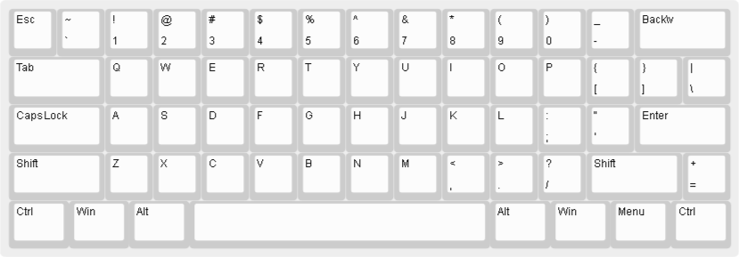
Or The 2U Full Size:

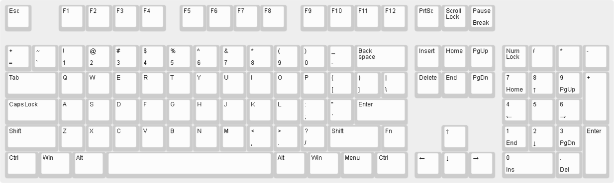

### Original keycaps
You can even keep your original keycap set on the full size!
Though the plate would be a little misaligned.

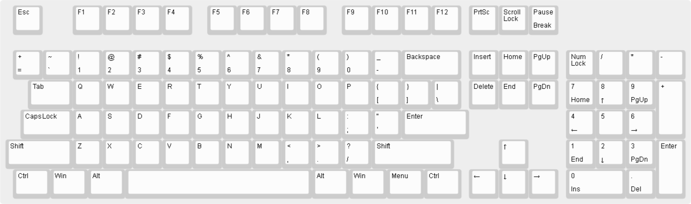
Or you can replace the left keys with 1U replacements and left-align the keyboard.
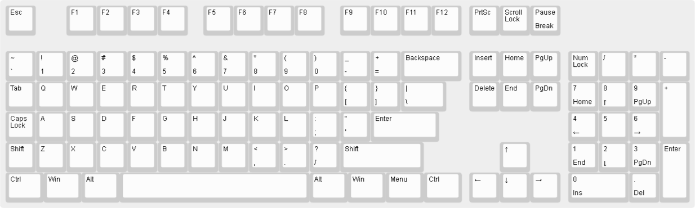
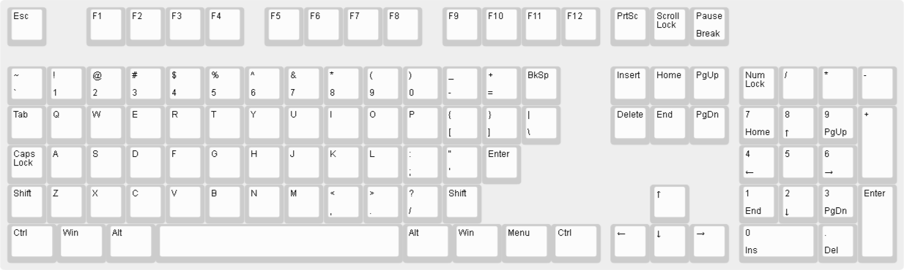

### Other
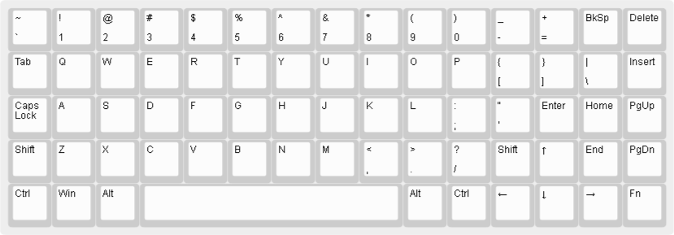
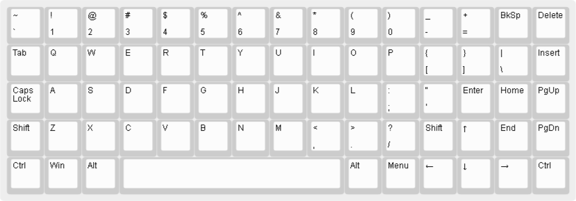
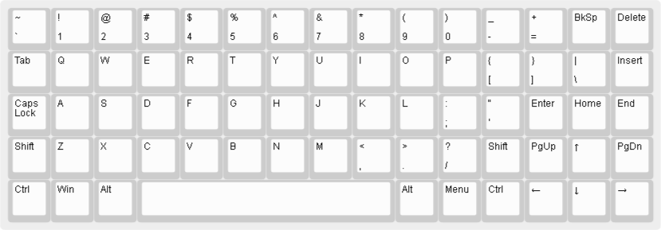
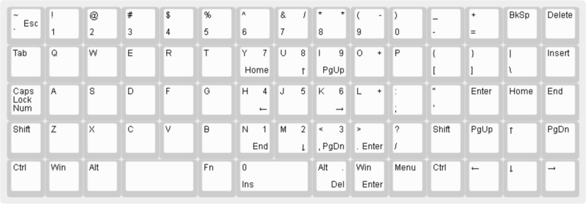
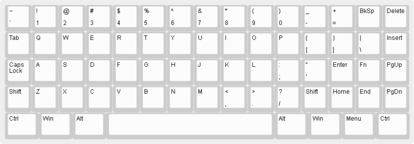
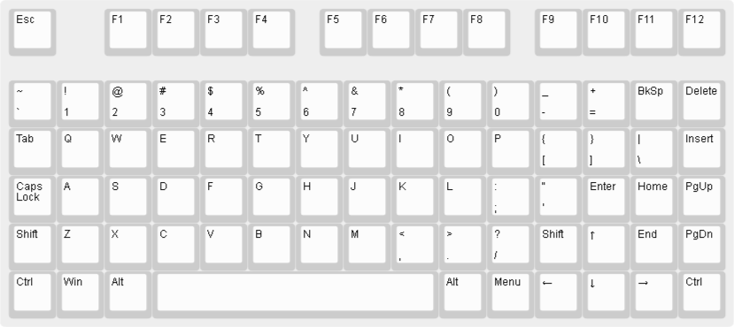
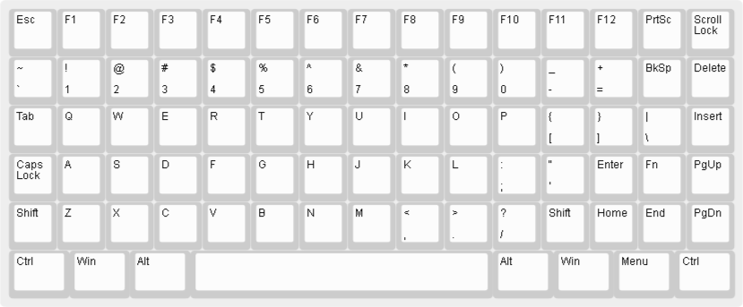
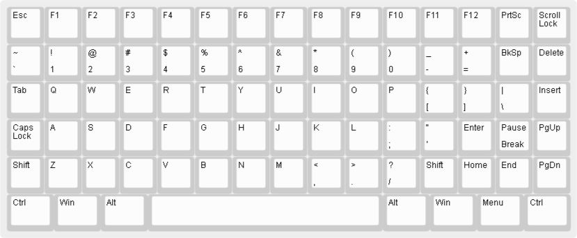
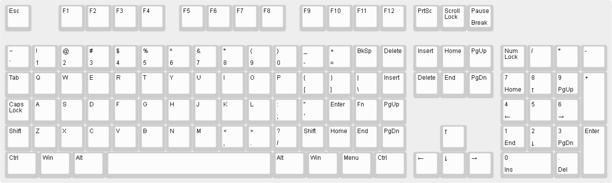
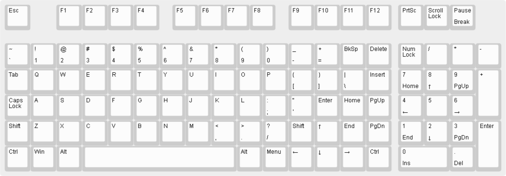
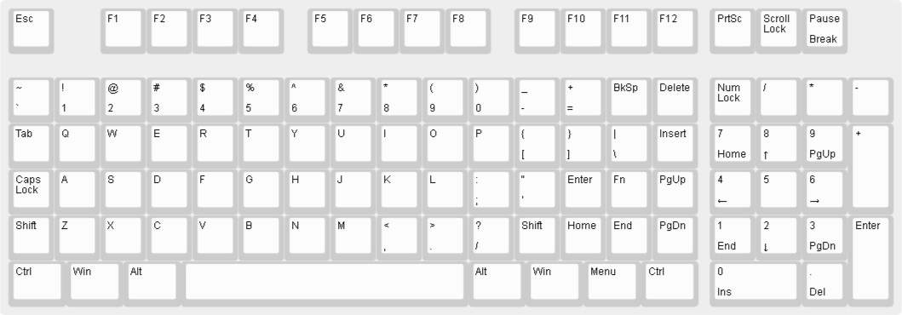

