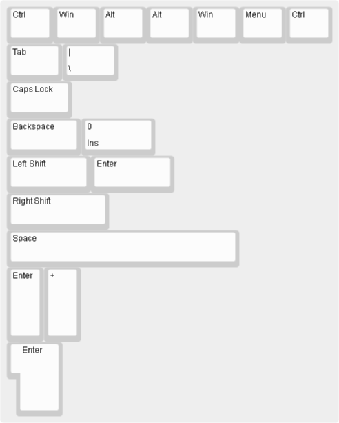

## Key sizes
* Keeping the original keycap set
* 2U spacebar or 2U backspace etc.
* 2U for all special keys
* all keys in 1U

To see what we are dealing with, here are the original keycap sizes that are different to 1Ux1U:

