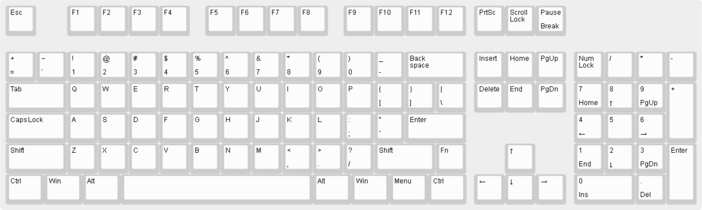
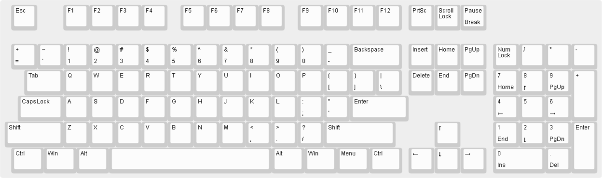
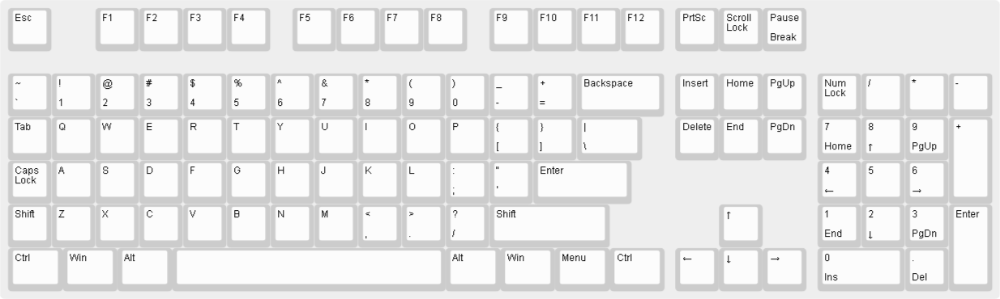
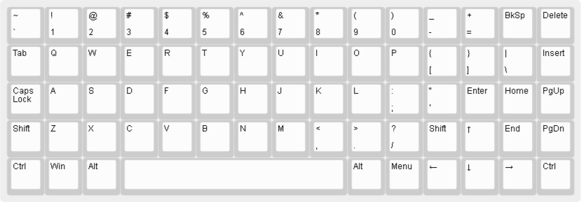
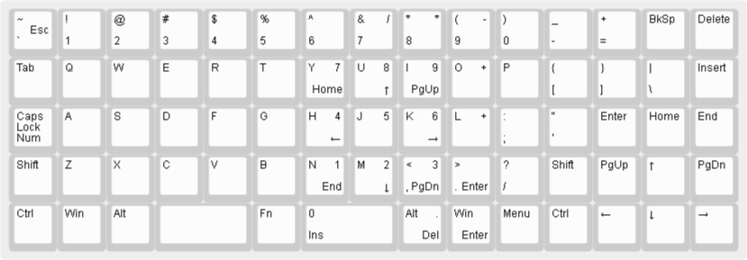
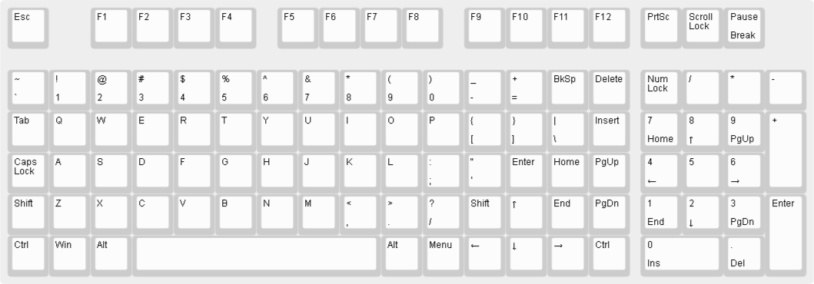
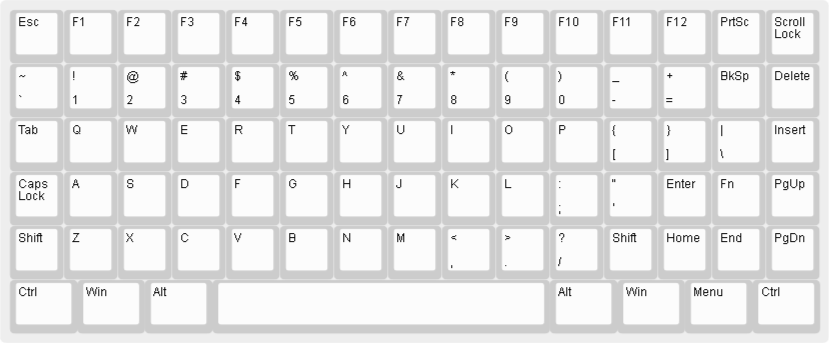
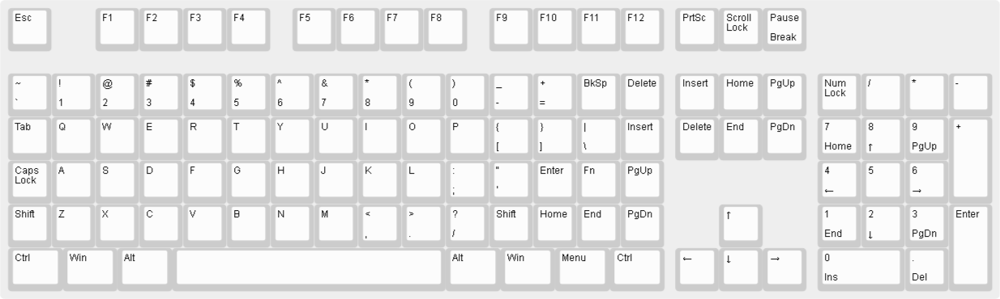
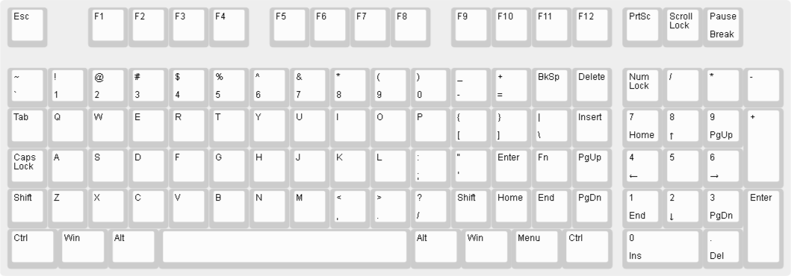

# WANING!

Consider this page just as my own personal mind dump!
I will probably never build any of the following keyboards.

## Larger key caps

Some users want larger caps even in the ortholinear layout.

## 2U

To see this on the 60%:

Or The 2U Full Size:

## Original keycaps

You can even keep your original keycap set on the full size!
Though the plate would be a little misaligned.

Or you can replace the left keys with 1U replacements and left-align the keyboard.

## Arrows

There are several ways, if you want to add the arrow cluster to 60%:

Or the 75 size with arrows:

Or the navless with arrow keys:

## Nav keys

We can keep original Ctrl, Alt, Win and Menu keys together with the Space Bar.

But this layout repeats several of the nav keys if put on the full size keyboard:

Better to be put on a navless:

